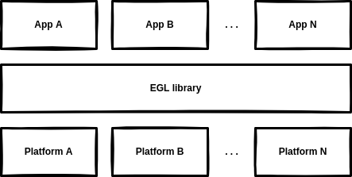
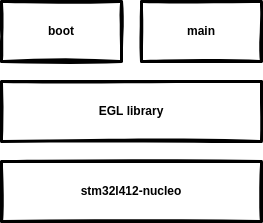
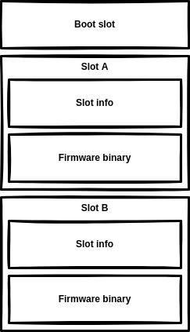
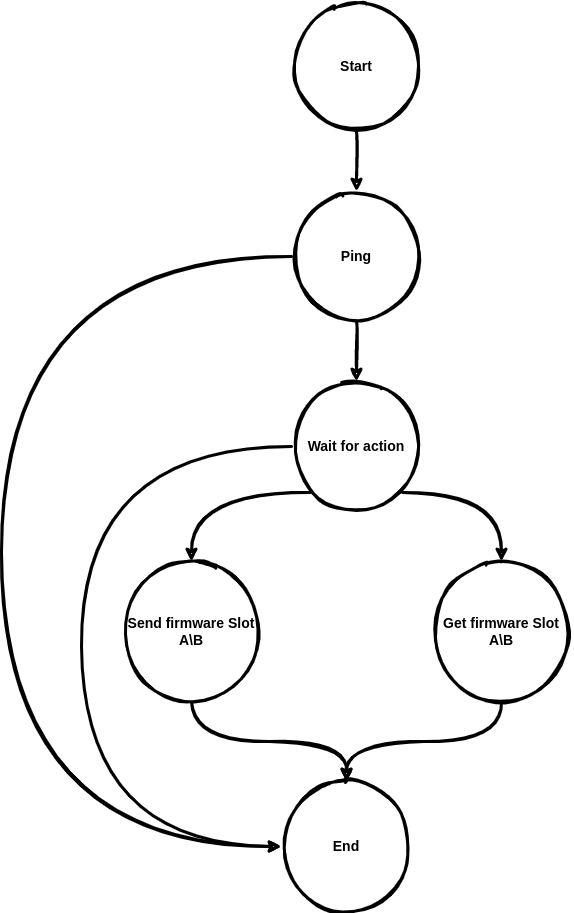

## Structire

<p align="center">
  
</p>

The solution contains 3 major layers:
 * **Application layer** - This layer contains buiseness logic if specific application
 * **EGL library** - Embedded Generic Library - Core framework that provide top level interfaces for application layer to interact with platfrm specific elements (such as interfaces, pinsm timers, etc.). As well, EGL provide low level interfaces to paltform layes that shall be implemented by platform itself.
 * **Platform layer** - Contains all platform specific implementations iecessary to suttisfy ieeds of application level. Based on EGL library low level API.

 This specific implementation of the concept contains following parts:
<p align="center">
  
</p>

Two applications has been implemented:
 * **main** - Simple LED blink example (green LED on STM32L412-nucleo board)
 * **boot** - bootloader that supports FOTA with RFM66 module

Just one single flatform has been implemented:
 * **stm32l412-nucleo + rfm66**

### Slots structure
<p align="center">
  
</p>

The solution contains following slots:
 * **Boot** - Slot that shall contains bootloader
 * **Slot A** - Slot for application built for slot A
 * **Slot B** - Slot for application built for slot B

The firmware for application slot is build in way that it is devided in two major parts:
 * **info section** - section that contains the firmware metadata such as binary size, CRC chechsum, version etc.
 * **binary image** - the firmware itself

### Bootloader application
The bootloader application conatins two main components:
 * **FOTA manager** - The component is responcible for performing of Firmware Update Over the Air with a radiomodule (RFM66).
 * **Boot manager** - The module is responcible for analyzing, validation and booting of specific slot

#### FOTA manager

<p align="center">
  
</p>

The FOTA manager is implemented in a way of "kind of state machine" and may be in following steps:
* **Start** - Initial state of FOTA manager. Do nothing, just switch to ping state.
* **Ping** - In this state Radio module starts to send PING messagge and try to receive PING message. If it doesn't able to receive any ping message for specific timeout (5 seconds) it goes in *END* state. Othervise it transits to Wait for action state.
* **Wait for action** - it this state (which has timeout 5 minutes) the manager is waiting for further actions. Following actions might be performed:
    * If user press SW2 button, new firmware for slot A will be requested from nearby module. FOTA manager transits to *Get firmware for slot A* state
    * If user press SW1 button, new firmware for slot B will be requested from nearby module. FOTA manager transits to *Get firmware for slot B* state
    * Nearby module send request to update slot A. FOTA manager transits to *Send firmware for slot A* state
    * Nearby module send request to update slot B. FOTA manager transits to *Send firmware for slot B* state

* **Send firmware for slot A/B** - In this state FOTA manager wait for request to send firmware part from device under update. Such request contains following data: page and offset to send.
The implementation has limeted and fixed payload size equals to 128 bytes. As such FOTA manager will receive such request it will fullwill data packet and send it to the device under update.
The Manager will be is the state as soon as the update timeout will be expired (10 minutes) or till it reveice *End mark* packet from device under update
* **Get firmware for slot A/B** - In this state FOTA manager send requests to get part of firmware to the updater. The request contains following data: page and offset to get. As soon as it will get first page of firmware from updater it will read info section and findout size of firmware to get. Also in increment *boot number* (See boot manager description) and write it on device flash. As soon as full binary will be received FOTA manager transits to *End* state. For this state 10 minutes timeout is applied.
* **End state** - In this state FOTA send *End mark* to other device to notify if that FOTA manager end it process.

#### Boot manager
The boot manager is:
1. Readout information about all available on device slots, put it in *slot table* and print it out to a console.
1. Analyse *boot number* of each application slot and sort *slot table* in a way that the firmware with highest *boot number* appeares in the begining of *slot table*
1. Validate each slot from *slot table* and as soon the application has been validated successfully, boot the application

If there woun't be any valid slot the bootloader will reset the device and will try to get new firmware with FOTA manager

## Dependencies

| Dependency        | Version | Description      |
| :---              | :---    | :---             |
| cmake             | 3.24.1  | Build tool       |
| arm-none-eabi-gcc | 10.3.1  | Compiller        |
| gdb-multiarch     | 12.1    | GDB client       |
| pyocd             | 0.34.2  | Flash/debug tool |
| python3           | 3.10.12 |                  |
| crcmod            | 1.7     | python module to calculate image crc |

## Build

Build main application for slot A:
```bash
./project.sh build -p stm32l412-nucleo -a main
```

Build main application for slot B:
```bash
./project.sh build -p stm32l412-nucleo -a main -s b
```

Build bootloader:
```bash
./project.sh build -p stm32l412-nucleo -a boot
```

## Flash

Flash bootlaoder
```bash
./project.sh flash -p stm32l412-nucleo -a boot
```

Flash application to slot A:
```bash
./project.sh flash -p stm32l412-nucleo -a main
```

Flash application to slot B:
```bash
./project.sh flash -p stm32l412-nucleo -a main
```

## Debug

Start debug session fot bootloader
```bash
./project.sh debug -p stm32l412-nucleo -a boot
```
Start debug session for main application
```bash
./project.sh debug -p stm32l412-nucleo -a main
```

## Usage

1. Reset both devices
1. As soon as they ping each other, they will transit to "Wait for action" state.
2. Press SW2 to update slot A or SW1 to update slot B
3. Wait for update completion.
